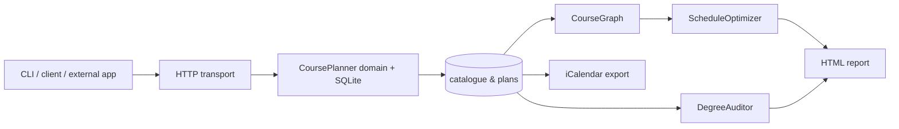

<div align="center">
  

  <br/>

  [](https://github.com/shiv814/campusflow-api/actions/workflows/test.yml)
  
  
  
  

  **A dependency-free academic-planning platform that combines a real REST API, SQLite persistence, prerequisite graph analysis, degree auditing, multi-term scheduling, calendar export, and portfolio-grade reporting.**
</div>

---

## Why this project exists

Course planning looks simple until real constraints collide: prerequisites, term availability, timetable conflicts, credit limits, workload, degree requirements, completed courses, and long prerequisite chains. CampusFlow models those constraints as explicit domain rules instead of a spreadsheet full of assumptions.

Version 3 expands the original catalogue/planning API into a broader **academic decision engine**. The project is intentionally built almost entirely with the Python standard library so the architecture and algorithms remain visible rather than hidden behind frameworks.

## v3 at a glance

| Area | What CampusFlow now does |
|---|---|
| Catalogue | Searchable courses, departments, capacities, delivery modes, meetings, prerequisites and status |
| Persistence | SQLite schema migrations, foreign keys, indexes, transactions and compatibility with older databases |
| REST API | CRUD, filtering, pagination, analytics, validation, recommendations, CSV export, CORS and request IDs |
| Prerequisite graph | DAG validation, cycle detection, topological order, descendants, bottleneck scores and critical paths |
| Schedule optimizer | Multi-term planning constrained by prerequisites, offered terms, credits, course count and weekly workload |
| Degree audit | Requirement groups, credit progress, missing requirements and weighted GPA calculation |
| Calendar export | Recurring RFC 5545-compatible `.ics` events for planned meetings |
| Reports | Self-contained responsive HTML planning report with degree progress and term cards |
| Client SDK | Dependency-free `urllib` client with retries and structured errors |
| Verification | Unit + HTTP integration tests across Python 3.10–3.13 in GitHub Actions |

## Architecture



The core is deliberately layered: transport does not own planning rules, persistence does not own presentation, and the v3 planning algorithms can run independently from the HTTP server.

## Fast start

```bash
git clone https://github.com/shiv814/campusflow-api.git
cd campusflow-api
python -m pip install -e .
campusflow-seed --db campusflow.db
campusflow-api --db campusflow.db --port 8000
```

### Run the v3 planning demo

```bash
campusflow-demo
```

That generates `campusflow-demo.html`, `campusflow-demo.ics`, and terminal output showing the prerequisite critical path and recommended term sequence.

## Prerequisite graph engine

```python
from campusflow.graph import CourseGraph, CourseSpec

courses = [CourseSpec("ENGG*1410", "Programming"), CourseSpec("CIS*2520", "Data Structures", prerequisites=("ENGG*1410",))]
graph = CourseGraph(courses)
print(graph.topological_order())
print(graph.critical_path())
print(graph.bottleneck_scores())
```

A cyclic or dangling prerequisite fails fast rather than creating a silently impossible plan.

## Multi-term schedule optimization

The optimizer is deterministic and explainable. It ranks eligible courses using prerequisite unlock value, difficulty balance and workload while enforcing hard credit/course/workload/term limits. It is intentionally not marketed as an “AI scheduler”; it is an auditable constraint-aware heuristic whose decisions can be inspected and tested.

## Degree auditing

Degree requirements are represented as explicit requirement groups with credit and course-count thresholds. The resulting audit reports overall progress, missing groups, completed/remaining requirement courses and weighted GPA.

## API surface

Representative endpoints include `/health`, `/analytics`, `/courses`, `/courses/{code}`, `/plans`, `/plans/{id}`, `/plans/{id}/validate`, `/plans/{id}/recommendations` and `/plans/{id}/export.csv` with full CRUD where appropriate.

See [`docs/API.md`](docs/API.md) for conventions and error semantics.

## Engineering decisions worth discussing

- **Zero runtime dependencies:** exposes HTTP, persistence and serialization fundamentals directly.
- **Backward-compatible schema changes:** older databases are upgraded instead of discarded.
- **Graph correctness before optimization:** cycle/dangling-reference detection prevents impossible plans from looking valid.
- **Hard constraints vs ranking:** validity constraints are enforced; ranking only chooses among valid candidates.
- **Portable outputs:** HTML and iCalendar demonstrate the project without a hosted frontend.
- **Deterministic scheduling:** identical inputs produce identical plans, simplifying debugging and tests.

## Repository map

```text
campusflow/
  api.py          HTTP transport and REST routes
  db.py           SQLite-backed domain service
  seed.py         repeatable sample data
  graph.py        prerequisite DAG + schedule optimizer
  audit.py        degree requirement engine + GPA
  calendar.py     .ics export
  report.py       self-contained HTML report
  client.py       dependency-free HTTP client
  demo.py         end-to-end v3 demonstration

tests/            unit and HTTP integration coverage
docs/             architecture, API, engineering and security notes
assets/           README presentation assets
```

## Verification

```bash
python -m compileall campusflow
python -m pytest -q
python -m campusflow.demo
```

CI runs Python **3.10, 3.11, 3.12 and 3.13**.

## Documentation

- [Architecture](docs/ARCHITECTURE.md)
- [API conventions](docs/API.md)
- [Engineering notes](docs/ENGINEERING.md)
- [Security model](docs/SECURITY.md)
- [Contributing](CONTRIBUTING.md)

## Scope

CampusFlow is an engineering portfolio project and reference implementation, not an official University of Guelph advising system. Real degree requirements must be verified against the authoritative academic calendar and an academic advisor.

## License

MIT © Shivam Patel
