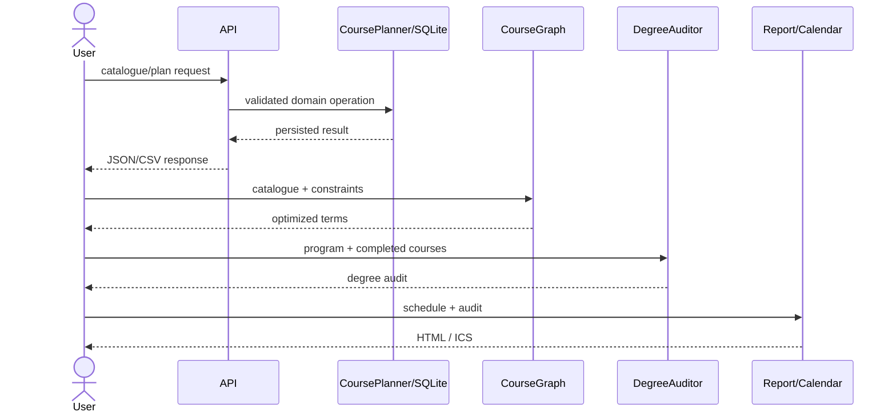

# CampusFlow Architecture

CampusFlow separates transport, persistence, planning algorithms, academic requirements and presentation so each layer remains testable and understandable.

## Layers

- **HTTP transport (`api.py`)** owns routing, JSON/CSV responses, CORS, request IDs and error mapping.
- **Persistent domain service (`db.py`)** owns SQLite schema/migrations, catalogue records, plans, transactions and persisted validation.
- **Planning algorithms (`graph.py`)** own prerequisite DAG validation, critical-path analysis and multi-term optimization independently of SQLite.
- **Academic requirements (`audit.py`)** own requirement groups, credit progress and GPA calculations.
- **Presentation/export (`report.py`, `calendar.py`)** convert model output to portable HTML and iCalendar artifacts.
- **Integration client (`client.py`)** provides a dependency-free external consumer.

## Scheduler strategy

The scheduler advances Fall → Winter → Summer, filters to prerequisite-complete/term-available courses, ranks by downstream unlock value and workload balance, then applies hard credit/course/workload caps. It is deterministic and explainable rather than claiming global optimality.

## Complexity

Graph construction and topological order are O(V+E). Descendant scoring is currently O(V+E) per source; this is comfortably small for university-sized catalogues and could later be cached or precomputed.
